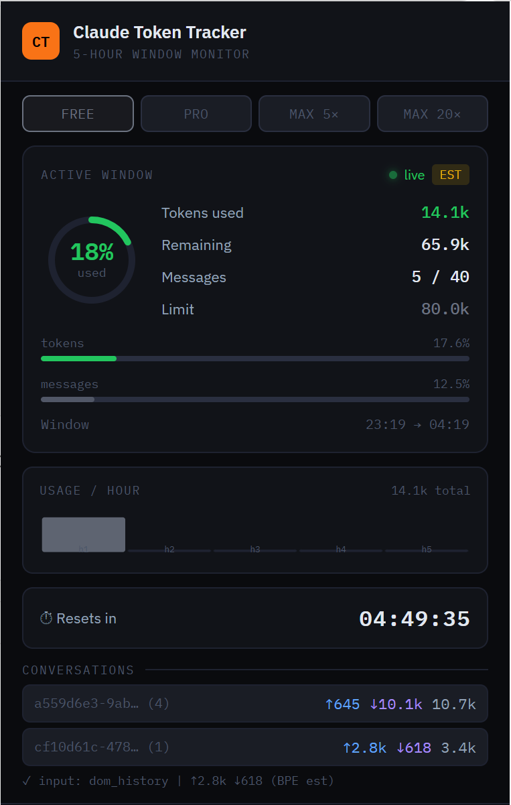

<div align="center">


# Claude Token Tracker

**The only browser extension that intercepts Claude.ai network traffic to track real token usage.**

[](LICENSE)
[](manifest.json)
[]()
[]()



</div>

---

## Why this exists

Claude.ai enforces a **5-hour rolling usage window**. When you hit the limit, the conversation stops. The platform shows a vague progress bar with no token breakdown — you can't see how much each conversation costs, whether a long chat is eating your budget, or exactly when the window resets.

Every other tracker estimates tokens from the DOM. **Claude Token Tracker hooks directly into `window.fetch()` and parses the real SSE stream**, capturing token data from the actual API response — including artifacts, dynamic outputs, thinking tokens, and tool use.

---

## Features

| Feature | Detail |
|---|---|
| **Real SSE stream parsing** | Hooks `fetch()` in the page's main world to tee and parse the live stream |
| **Full conversation cost** | Reads the entire conversation history from the request body — correctly accounts for context window growth |
| **All output types** | Tracks text, extended thinking tokens, tool use JSON, artifacts/code |
| **4 plan modes** | Free · Pro · Max 5× · Max 20× with empirically calibrated limits |
| **5-hour window timer** | Live countdown, auto-reset, manual reset, persists across page reloads |
| **Per-conversation breakdown** | Input ↑ / Output ↓ / Total per chat |
| **Hourly usage sparkline** | Bar chart of token consumption across the 5-hour window |
| **Browser notifications** | Alerts at 80% and 95% usage |
| **Badge indicator** | Live % on the extension icon, color-coded green → yellow → orange → red |
| **History** | Last 20 completed windows archived |

---

## How it works

Most token trackers read text from the DOM after rendering. This misses artifacts, dynamic components, thinking tokens, and tool calls — often the heaviest consumers.

Claude Token Tracker uses a three-layer capture strategy:

```
1. JSON.stringify hook   ← intercepts the full conversation payload before fetch
2. DOM history reader    ← reads all rendered messages as fallback
3. DOM input buffer      ← captures the current input box as last resort
```

For output, the extension **tees the ReadableStream** from the SSE response:

```javascript
// Simplified core mechanic
window.fetch = async function (...args) {
  const response = await originalFetch(...args);
  const [forClaude, forUs] = response.body.tee();
  parseSSEStream(forUs); // we read our copy
  return new Response(forClaude, ...); // Claude gets the original
};
```

The SSE stream is parsed event by event:
- `content_block_delta` → accumulates text, thinking, and tool JSON
- `message_limit` → Claude.ai proprietary event (does **not** expose token counts)

Since Claude.ai does not expose `input_tokens` in the stream (unlike the public API), input is estimated using a **BPE approximation** calibrated against the Claude.ai usage bar.

### Token estimation

```
Natural language  → ~4 chars / token
Code blocks       → ~3.5 chars / token
URLs              → ~3 chars / token
Non-ASCII / emoji → ~2 tokens each
System overhead   → +400 tokens (once per conversation)
```

### Plan limits — empirically calibrated

These limits were derived by measuring the Claude.ai usage bar delta against known input sizes. Anthropic does not publish exact token limits for Claude.ai chat.

| Plan | Tokens / 5h | Est. Messages |
|---|---|---|
| Free | ~80,000 | ~40 |
| Pro | ~640,000 | ~225 |
| Max 5× | ~1,280,000 | ~450 |
| Max 20× | ~5,120,000 | ~1,800 |

> Methodology: sent N words of input in a fresh conversation, measured % change on the usage bar, derived tokens-per-percent, extrapolated to 100%. Tested with 1k / 2k / 5k word inputs on Claude Pro.

---

## Installation

### Chrome / Edge (Developer Mode)

1. Download or clone this repository
2. Open `chrome://extensions` or `edge://extensions`
3. Enable **Developer mode** (toggle, top-right)
4. Click **Load unpacked**
5. Select the `claude-tracker` folder
6. Pin the **CT** icon to your toolbar

> Chrome Web Store release coming soon.

---

## Project structure

```
claude-tracker/
├── manifest.json          # Manifest V3
├── popup.html             # Extension popup UI
├── popup.js               # Rendering, sparkline, timer, plan switcher
├── src/
│   ├── content.js         # MAIN WORLD — fetch hook, SSE parser, BPE estimator
│   ├── bridge.js          # ISOLATED WORLD — relay between page and background
│   └── background.js      # Service worker — state, alarms, notifications, badge
└── icons/
    ├── icon16.png
    ├── icon48.png
    └── icon128.png
```

---

## Accuracy

| Component | Method | Accuracy |
|---|---|---|
| Output tokens | BPE estimate from streamed text | ±5–10% |
| Input tokens | BPE estimate from full conversation body | ±10–15% |
| System prompt | Fixed 400-token overhead per conversation | Approximate |
| Plan limits | Empirically measured | ±10–20% |

**Why not exact?** Claude.ai's SSE stream uses a proprietary `message_limit` event that does not expose `input_tokens` — unlike the public API at `api.anthropic.com`. This is a platform constraint, not a technical limitation of the extension. No token tracker for Claude.ai chat can obtain exact counts without server-side access.

---

## Troubleshooting

**Tokens not updating after a message?**
Make sure you're on `claude.ai` and the extension is enabled. Try refreshing the page once — the fetch hook injects at `document_start` and needs a fresh page load.

**Input showing 0?**
The `stringify` capture method may not be firing. The extension will fall back to DOM history reading. Check the small status line at the bottom of the popup.

**Numbers seem much higher than expected?**
Long conversations are expensive — Claude re-reads the full context window on every turn. A 20-message conversation costs significantly more per message than a fresh one. This is working as intended.

**Claude.ai updated and tracking broke?**
Anthropic occasionally updates their frontend. If DOM selectors break, open an issue with your browser version.

---

## Contributing

Pull requests welcome. Key areas:
- Improving DOM selectors for new Claude.ai markup
- Refining the BPE estimator accuracy
- Adding Firefox support (requires `world: MAIN` polyfill)

---

## License

MIT — see [LICENSE](LICENSE)

---

## Disclaimer

This extension reads network traffic **locally in your browser**. No data is sent anywhere. It does not interact with the Claude.ai API — it only observes responses that your browser is already receiving. Use responsibly and in accordance with Anthropic's Terms of Service.
